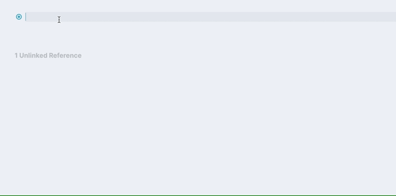

# Logseg Movies Plugin

[Logseq](https://github.com/logseq/logseq) plugin that helps you insert your favorite anime and movie titles into your documents.

## Supported Commands
* 🎬 `Movie (IMDB)` search through IMDB and specify a movie you watched or plan to
* 🎬 `Anime (MyAnimeList)` search through MAL to remember some cool anime you watched

## Demo

## 3rd Party APIs
The plugin works via the following APIs:
* For the IMDB, it uses the internal IMDB search API `https://v2.sg.media-imdb.com/suggestion`
* For the MyAnimeList, it uses [Jikan](https://jikan.moe)

## Development
* `npm install` to install dependencies
* `npm run dev` to build dev version of the plugin
* `npm run build` to build release version of the plugin
* To add a locally built version of the plugin to your Logseq:
  * Enable developer mode in `Settings -> Advanced`
  * Navigate to the `Plugins` page from the main menu
  * Select `Load unpacked plugin` and choose this repository root

## License
The project is licensed under MIT license, see [LICENSE.MD](LICENSE.MD)
